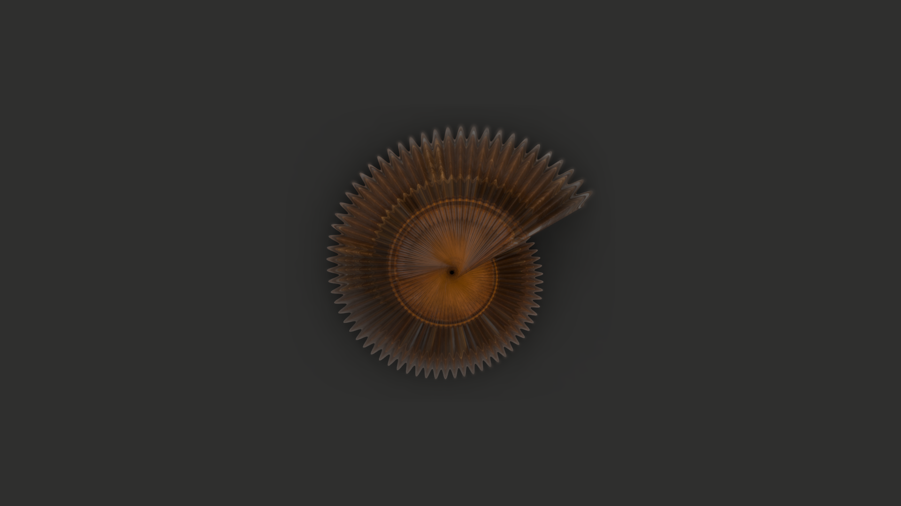

# TraitBlender Documentation

Welcome to the TraitBlender documentation! TraitBlender is a Blender add-on for generating museum-style images for morphological datasets, developed by Caleb Charpentier.

## Documentation Sections

### [Getting Started](./getting-started/)
- [Installation Guide](./getting-started/installation.md)
- [Quick Start (GUI)](./getting-started/quick-start.md) - Learn the graphical interface
- [Quick Start (API)](./getting-started/quick-start-api.md) - Learn the Python API
- [Blender Settings](./getting-started/blender-optimization.md) - Performance tips

### [Configuration](./configuration/)
- [Configuration Files](./configuration/config-files.md) - YAML configuration structure

### [Tutorials](./tutorials/)
- [Basic Specimen Imaging](./tutorials/basic-imaging.md) - Create your first images

### [API Reference](./api/)
- [Scene Assets](./api/scene-assets.md) - Object positioning and management

## About TraitBlender

TraitBlender is a Blender add-on designed for researchers and institutions working with morphological datasets who need to generate high-quality, standardized images for scientific analysis, museum documentation, and neural network training.

### Key Features

- **Museum-style specimen imaging** - Professional lighting and camera setups
- **Morphospace visualization** - Generate 3D specimens from mathematical models (currently CO_Raup shell morphospace)
- **Dataset integration** - Import CSV/Excel files with automatic species column detection
- **Statistical transforms** - 10+ probability distributions for data augmentation
- **Table coordinate system** - Consistent positioning relative to museum table
- **YAML configuration** - Reproducible, serializable scene settings
- **Transform pipeline** - Chain multiple statistical transformations
- **Blender 4.3+ integration** - Modern rendering engines (EEVEE, Cycles)

### Workflow

1. **Setup** - Load museum scene with table, lighting, and camera
2. **Configure** - Adjust scene settings via GUI or YAML config
3. **Select Morphospace** - Choose mathematical model (e.g., CO_Raup)
4. **Import Dataset** - Load CSV/Excel with morphological traits
5. **Generate Specimens** - Create 3D models from dataset parameters
6. **Apply Transforms** - Add statistical variation for data augmentation
7. **Render** - Generate final images

For questions or support, please visit our [GitHub repository](https://github.com/Imageomics/TraitBlender). 