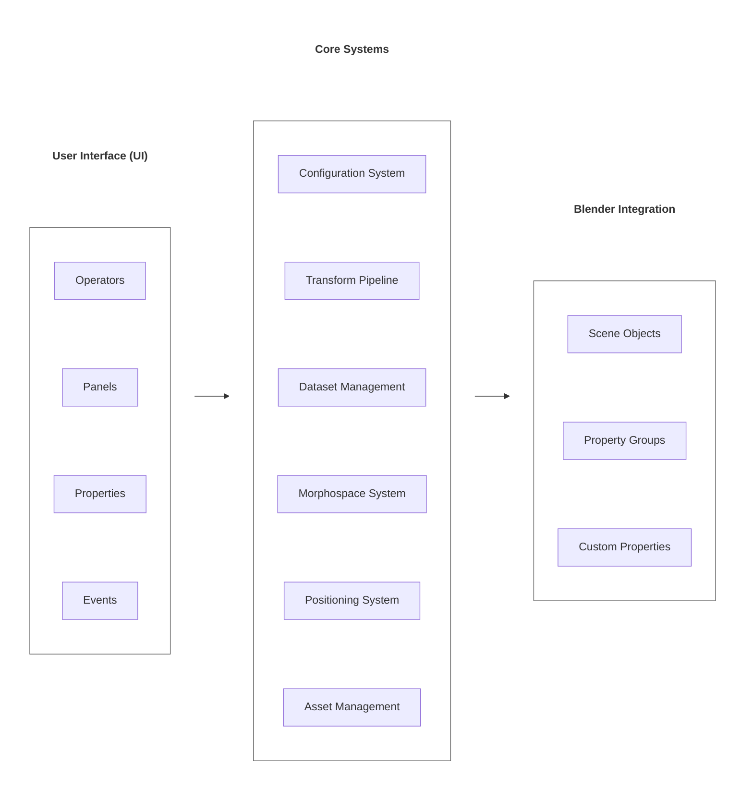

# TraitBlender Architecture

This document provides a high-level overview of TraitBlender's architecture, showing how the major systems interact and how data flows through the add-on. For detailed information about specific systems, see the [For Developers](./developers.md) documentation.

---

## System Overview

TraitBlender is organized into several interconnected systems:

