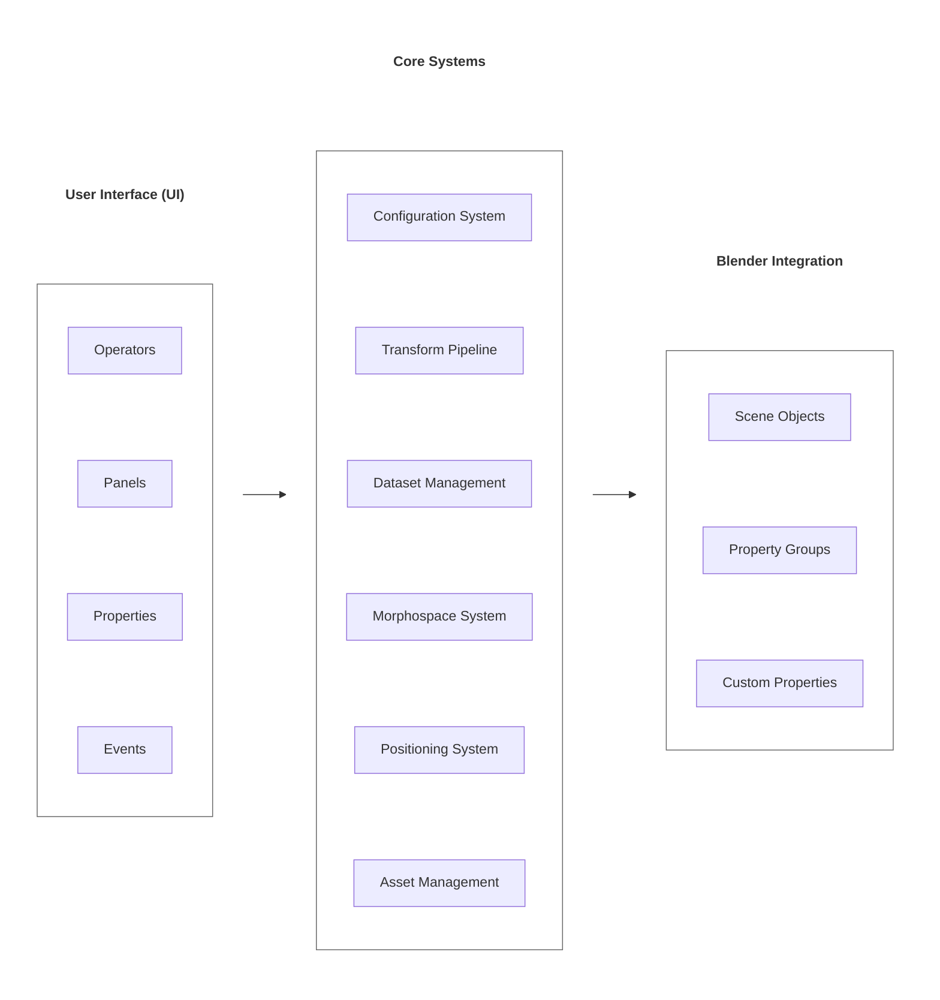

# TraitBlender Architecture

This document provides a high-level overview of TraitBlender's architecture, showing how the major systems interact and how data flows through the add-on.

---

## System Overview

TraitBlender is organized into several interconnected systems:

```mermaid
flowchart LR
    subgraph col1[" "]
        direction TB
        UITitle["User Interface (UI)"]
        subgraph UI[" "]
            direction TB
            Operators[Operators]
            Panels[Panels]
            Properties[Properties]
            Events[Events]
            Operators ~~~ Panels
            Panels ~~~ Properties
            Properties ~~~ Events
        end
        UITitle ~~~ UI
    end
    
    subgraph col2[" "]
        direction TB
        CoreTitle["Core Systems"]
        subgraph Core[" "]
            direction TB
            Config[Configuration System]
            Transform[Transform Pipeline]
            Dataset[Dataset Management]
            Morphospace[Morphospace System]
            Positioning[Positioning System]
            Assets[Asset Management]
            Config ~~~ Transform
            Transform ~~~ Dataset
            Dataset ~~~ Morphospace
            Morphospace ~~~ Positioning
            Positioning ~~~ Assets
        end
        CoreTitle ~~~ Core
    end
    
    subgraph col3[" "]
        direction TB
        BlenderTitle["Blender Integration"]
        subgraph Blender[" "]
            direction TB
            SceneObjects[Scene Objects]
            PropertyGroups[Property Groups]
            CustomProps[Custom Properties]
            SceneObjects ~~~ PropertyGroups
            PropertyGroups ~~~ CustomProps
        end
        BlenderTitle ~~~ Blender
    end
    
    col1 --> col2
    col2 --> col3
    
    
    style UITitle fill:transparent,stroke:transparent,font-weight:bold
    style CoreTitle fill:transparent,stroke:transparent,font-weight:bold
    style BlenderTitle fill:transparent,stroke:transparent,font-weight:bold
    style col1 fill:transparent,stroke:transparent
    style col2 fill:transparent,stroke:transparent
    style col3 fill:transparent,stroke:transparent
    style UI fill:transparent,stroke:#666
    style Core fill:transparent,stroke:#666
    style Blender fill:transparent,stroke:#666
```

